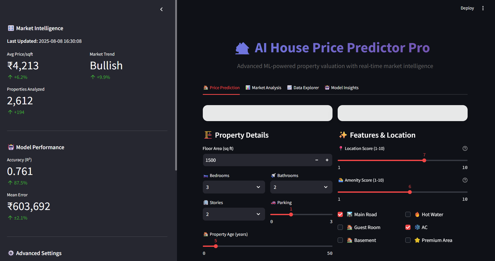
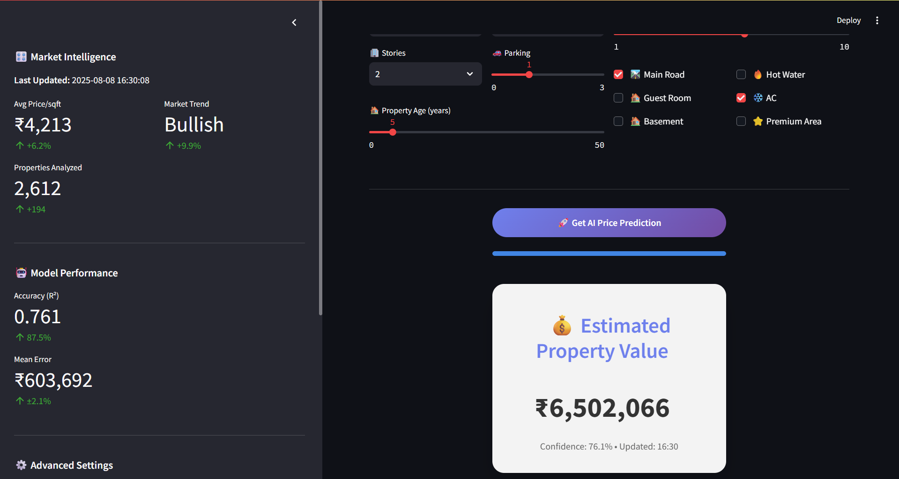
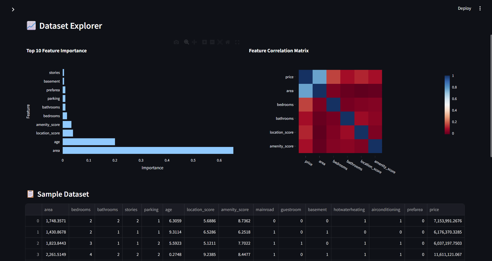
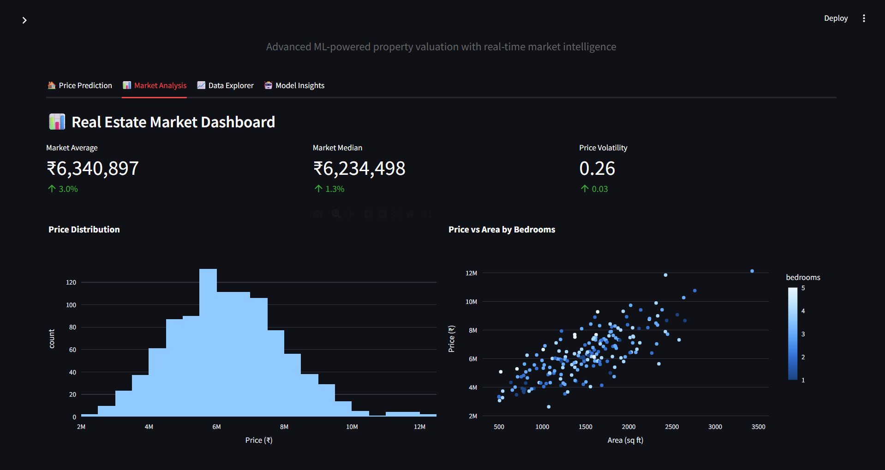

# 🏡 House Price Predictor

A **Machine Learning + Streamlit-based web application** that predicts house prices based on Indian real estate data such as bedrooms, bathrooms, property size, furnishing status, property age, and location tier.  
Built to help buyers, sellers, and real estate agents make **data-driven decisions**.

---

## 💡 Problem Statement
The real estate market in India can be unpredictable due to factors like location, property age, size, and furnishing. Buyers often overpay or miss good deals because they lack quick, data-backed insights.

---

## 💡 Our Solution
We created **House Price Predictor**, a simple yet powerful web app that:
- Predicts property prices using a trained ML model.
- Adjusts predictions based on **location tier**, **property furnishing**, and **age**.
- Visualizes price trends to help users make informed choices.

---

## 🚀 Features
- 💡 **Price Prediction** – Estimate property prices instantly.
- 📈 **Detailed Breakdown** – Price per sq. ft and total value.
- 📊 **Visual Insights** – Price distribution & size vs price graphs.
- 🏙️ **Location Tier Support** – Metro, Tier 2, Tier 3.
- 🛋️ **Furnishing & Age Adjustments** – Fine-tune predictions.
- 🎨 **Clean UI** – Indian-themed, responsive design.
- 💾 **Dataset-backed Accuracy** – Trained on real Indian housing data.

---

## 🛠 Tech Stack
- **Frontend & UI:** Streamlit  
- **Backend & ML:** Python (Scikit-learn, Pandas, NumPy)  
- **Data Visualization:** Matplotlib, Seaborn  
- **Deployment:** Streamlit Cloud / Render  

---
---

## 📸 Screenshots
|-----------|-----------------|
|  |  |
|-------------------|-------------|
|  |  |

---

## 🚀 Installation & Usage

### Prerequisites
- Python 3.7+
- pip installed
- Streamlit

# Clone the repository
git clone https://github.com/Tejarella/House-Prediction.git

# Navigate to the project folder
cd House-Price-Predictor

# Install dependencies
pip install -r requirements.txt

# To Run
streamlit run house.py
